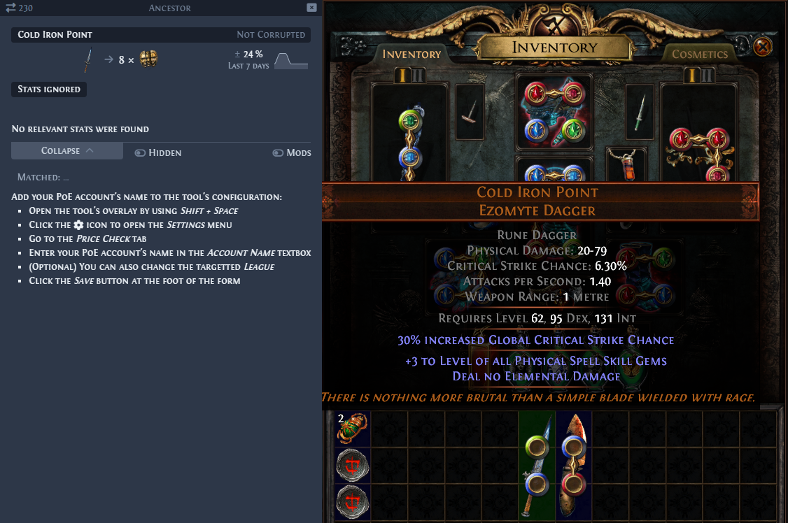
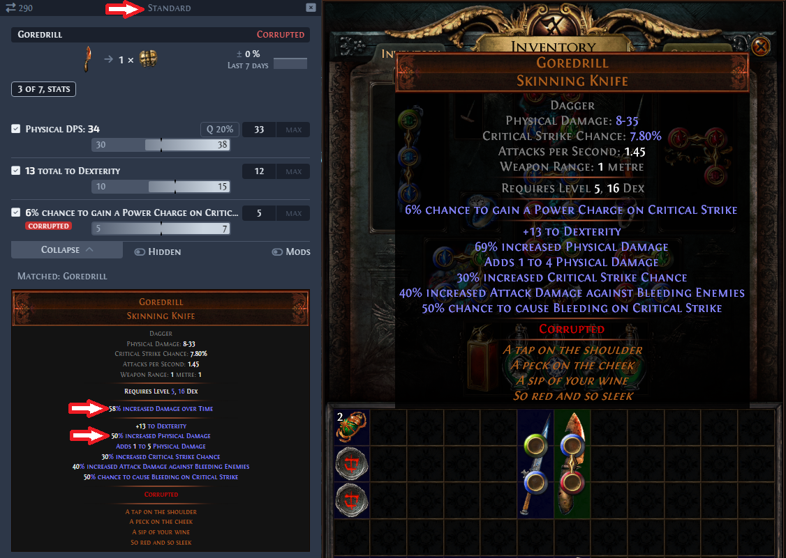
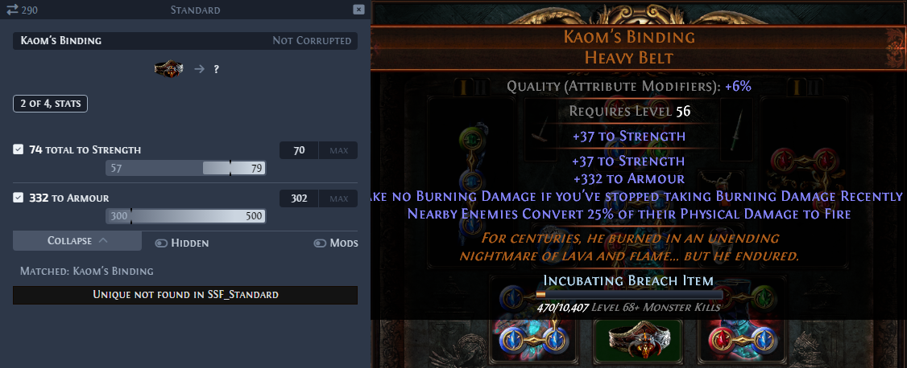

#  Awakened PoE Trade - PoE Ladder Edition

### Introduction

[PoE Ladder](https://poeladder.com/) is a website that lets you track your unique item collections in Path of Exile's various Solo-Self Found leagues.

This fork of [SnosMe's awakened-poe-trade app](https://github.com/SnosMe/awakened-poe-trade) replaces the price-checking feature with a lookup of PoE Ladder data for your account.  This will let you:
  - Check whether you already own a unique in a selected league
  - Compare the stats of the unique that you just found with the one that you own
  - Do cross-league lookups e.g. Find an item in a temporary league like SSF Ancestor and look it up in your SSF Standard collection

To get started, you can either build the app yourself using the instructions below or [join the PoE Ladder Discord](https://discord.gg/YppDk6b92c) to get the latest pre-build installer for the app.

### Using the App

Once you have installed the app, just hover over a unique item in the PoE client and use the **Ctrl + D** command to look up the item.

If you haven't set up your account in the app then you will see a set of instructions like those shown below:

Here you can see an example of a unique in SSF Ancestor being compared to the owned version in SSF Standard:

If you don't already have the unique in a league then you'll see an error message like the one below:

#  Awakened PoE Trade - PoE Ladder Edition

### Introduction

[PoE Ladder](https://poeladder.com/) is a website that lets you track your unique item collections in Path of Exile's various Solo-Self Found leagues.

This fork of [SnosMe's awakened-poe-trade app](https://github.com/SnosMe/awakened-poe-trade) replaces the price-checking feature with a lookup of PoE Ladder data for your account.  This will let you:
  - Check whether you already own a unique in a selected league
  - Compare the stats of the unique that you just found with the one that you own
  - Do cross-league lookups e.g. Find an item in a temporary league like SSF Ancestor and look it up in your SSF Standard collection

To get started, you can either build the app yourself using the instructions below or [join the PoE Ladder Discord](https://discord.gg/YppDk6b92c) to get the latest pre-build installer for the app.

### Using the App

Once you have installed the app, just hover over a unique item in the PoE client and use the **Ctrl + D** command to look up the item.

If you haven't set up your account in the app then you will see a set of instructions like those shown below:

Here you can see an example of a unique in SSF Ancestor being compared to the owned version in SSF Standard:

If you don't already have the unique in a league then you'll see an error message like the one below:

### Development

### 1. Set up the project

1) Clone project into VSCode
2) cd renderer
3) npm install
4) cd ..\main
5) npm install

### 2. How to build the project

Complete the steps in **1. Set up the project** prior to attempting this

1) Open the project in VSCode
2) cd renderer
3) npm run build
4) npm run make-index-files
5) cd ..\main
6) npm run build
7) npm run package

### 3. How to run in Dev mode

Complete the steps in **1. Set up the project** & **2. How to build the project** prior to attempting this

1) Open a cmd window
2) cd ..\awakened-poe-trade-poeladder\renderer
3) npm run dev
4) Leave that window running
5) Open the project in VSCode
6) cd main
7) npm run dev
8) Start PoE

### 4. How to create the installer

Complete the steps in **2. How to build the project** prior to attempting this

1) Open the project in VSCode
2) cd main
3) npm run package

### 5. How to debug an installation

The packaging process is dependent upon two separate builds: the "renderer" folder and the "main" folder. It then packages both of these up in to **%LocalAppData%\Programs\Awakened PoE Trade\resources\app.asar** based on the commands in **electron-builder.yml**.

An versioned installer is also available in **.\awakened-poe-trade-poeladder\main\dist**. This file should be uploaded to GitHub

You can manually edit the compiled app.asar file by:
1) [Installing 7-Zip (64-bit)](https://www.7-zip.org/download.html)
2) [Installing the "Asar7z" plugin (64-bit)](https://www.tc4shell.com/en/7zip/asar/)
3) Extracting the files/folders from your **app.asar** file then compare them to a working version

### Acknowledgments

- [SnosMe (Alexander Drozdov)](https://github.com/SnosMe)
- [libuiohook](https://github.com/kwhat/libuiohook)
- [RePoE](https://github.com/brather1ng/RePoE)
- [poeprices.info](https://www.poeprices.info/)
- [poe.ninja](https://poe.ninja/)

